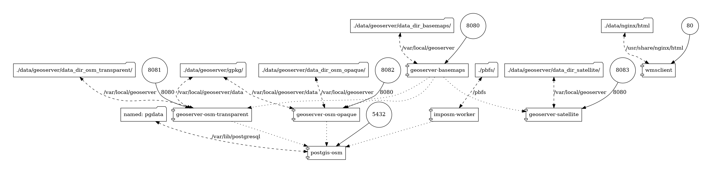

# all-basemaps-geoserver

**Get your preferred Basemaps dataset running in a local Geoserver instance with only 2 commands.**

<a href="https://www.youtube.com/watch?v=PQFKiLogSxM" rel="video"></a>

On previous image you can see the demo application in action (at http://localhost we serve a small app that allows to see the content of your deployment)

Project involves a docker-compose.yml file that assembles the necessary components to implement a Geoserver instance that publishes Street, Satellite and Hybrid views/layers locally on a single host/machine.

It's a merged/combined solution based on this repositories:

- [osm-geoserver-postgis](https://github.com/geotekne-argentina/osm-geoserver-postgis)
- [satellite-geoserver](https://github.com/geotekne-argentina/satellite-geoserver)

## Steps

With the scripts that are included in the folder we have simplified the steps to deploy a solution that includes a Geoserver instance publishing Street, Satellite and Hybrid views, using WMS service.

This simplification will work fine when deployment is done on the same host (on which the docker compose that initializes the system will be executed). If you have to deploy on more than one host, you have to consider some technical aspects (basically, the same as moving from docker compose to swarm or kubernetes, so you will have to adapt it).

The idea is to keep the use case simple (below is the diagram of containers and volumes to create).

**Preconditions:**

Note: you can check preconditions executing script **check-preconditions.sh**

1. Install [git](https://github.com/git-guides/install-git), [docker](https://docs.docker.com/engine/install/ubuntu/) and [docker compose (V2)](https://docs.docker.com/compose/install/) on the host machine.

2. Download the repository of this project.

   ```
   git clone https://github.com/geotekne-argentina/all-basemaps-geoserver
   ```

3. Optional: edit file **config.sh** and select which PBF file to download (from GeoFabrik, https://download.geofabrik.de/), otherwise default demo will download Estonia PBF file. Also you should define the same location for Satellital information, based on [this page](https://link.storjshare.io/s/jv5m557e5rc2r5yjkl6o7zmfowba/satellite/) pregenerated datasets.

**2 Steps**

1. Execute setup-datasets.sh script

   ```
   ./all-basemaps-geoserver/setup-datasets.sh
   ```

2. Once the datasets setup is finished, then execute startup.sh script

   ```
   ./all-basemaps-geoserver/startup.sh
   ```

**IMPORTANT:**
 - ensure that mapped ports (80, 8080, 8081, 8082, 8083, 5432) in your host are available and free to use.
 - remember to run the ./setup-datasets.sh script so you will be downloading the LOW resolution file, also with Global satellital raster file, and your selections.

Observations :

- OSM Data reset: Every time the docker compose is initialized, it is validated if there are files to import in the PBFs folder, and so the information of the OSM layers is reset. Only in the case of having the folder empty, that is to say without PBF files, is that the existing information on the pgdata volume will not be reset. So we suggest to run the ./setup-datasets.sh script at least one time, and then to add your PBFs files in the ./pbfs folder. After first execution of ./start.sh script (that will trigger the import process) we suggest to remove the PBFs files from the ./pbfs folder otherwise the import process will execute every time you start the docker composition)


## Technical Details

- One instance of each service
- Images used
  - geoserver(s): geotekne/geoserver:lime-alpine-2.16.2
    - 4 instances of geoserver are created. One for serving satellite data, one for OSM in opaque styles and one for transparent one. Finally, the main geoserver instance which serves the 3 layers shown in the demo app (hybrid layer is build as a layer group of satellite+transparent services from other geoserver instances)
  - postgis: kartoza/postgis:12.1
    - Used to store the OSM layers.
  - wmsclient: nginx:1.21.3-alpine
    - That shows in a simple example, an html+css+js web application, which allows to select between the 3 views (Street, Satellite and Hybrid), all from local setup.
  - imposm-worker: geotekne/imposm-worker:1.0.0
	  + Container that allows to ingest the PBFs files located at ./pbfs folder in the Postgis database
- Geoserver data volume mapped to folder on host
- Postgis data volume mapped to pgdata volume in docker
- Wmsclient data volume mapped to folder containing the sample web application.
- Ports mapped on host:
  - geoservers: 8080, 8081, 8082, 8083
  - postgis: 5432
  - wmsclient:80

## Diagram



